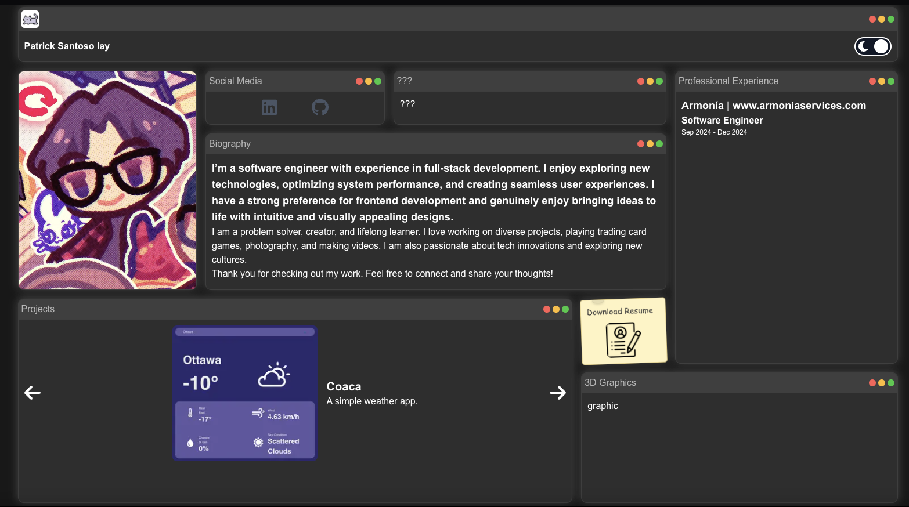
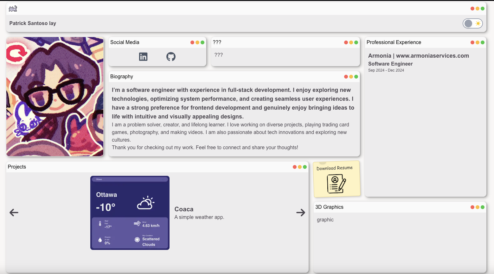

# Portfolio Website

This is a portfolio website built with [Next.js](https://nextjs.org), showcasing personal projects, resume, and information. It is designed with a dynamic layout that adapts to light and dark themes. The website includes custom components, such as a theme toggle, and leverages Vercel for deployment.

## Getting Started

First, run the development server:

```bash
npm run dev
# or
yarn dev
# or
pnpm dev
# or
bun dev
```

Portfolio Dark Theme

This is the dark mode theme of my portfolio.

### Portfolio Light Theme

This is the light mode theme of my portfolio.

Additional Features
- Sticky notes can be pressed and you can download my resume
- LinkedIn & Github will be uploaded to mine
